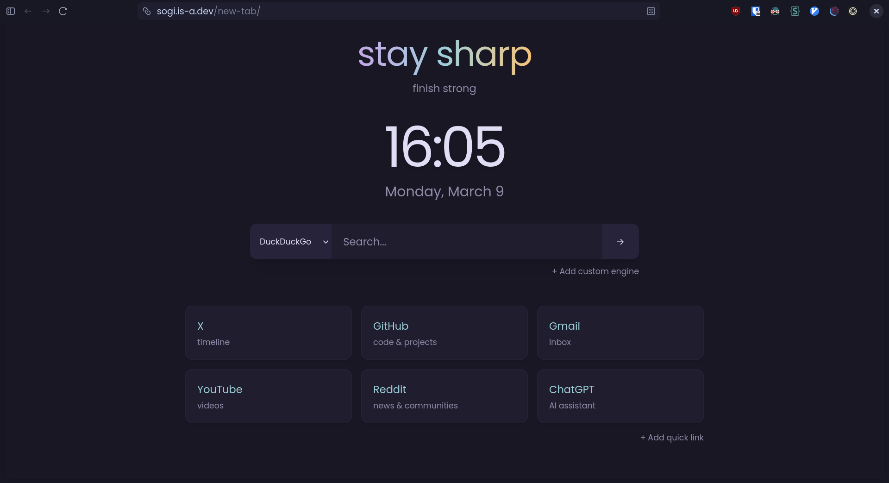
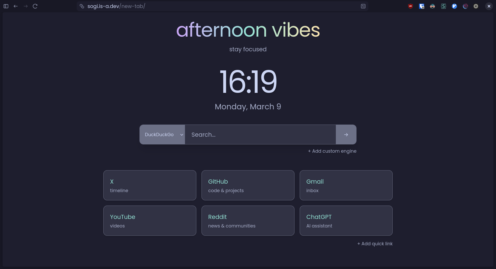

# New Tab Start Page

It is a themed start page for new tabs in the browser. It is a work in progress.

## Features

- Search bar with customizable search engines
- Quick Links with customizable Name and URLs
- Sortable Quick Links

## Preview

- Rose Pine Theme

  

- Catppuccin Theme

  

## Installation

1. Copy the url `https://sogi.is-a.dev/new-tab`
2. Open your browser settings and navigate to the section where you can set a custom new tab page.
3. Paste the copied URL into the field for the new tab page and save your changes.

## Adding New Themes

If you would like to add a new theme, please follow these steps:

1. Fork the repository.
2. Create a new branch.
3. Add the new theme css file to the `themes` directory and update the `index.json` with the new theme filename.
4. Submit a pull request.

_Cheers!_
